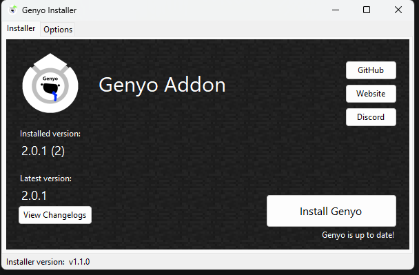
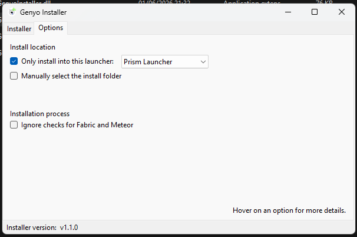

# Welcome to Genyo Installer

This repo is up mainly for educational purposes, that shouldn't really be taken seriously. Although I'm proud of the result, this was just a fun thing to do. 
Unfortunately it's a Windows application, but I'll remake this in Java one day so that everyone can use it. 
Until then, have fun using this little installer :>

**Yes I know the .exe is 100 MBs**

## Features
- Automatically detects your Prism Launcher instances, and gives you the option to choose which ones you would like to install Genyo to.
- Searches for Fabric and Meteor, and blocks if it can't find them.
- Ability to choose between only MC default or Prism launcher
- Ability to install into a manually given folder
- Keeping track of installed versions... uhhh kinda.

## Screenshots

